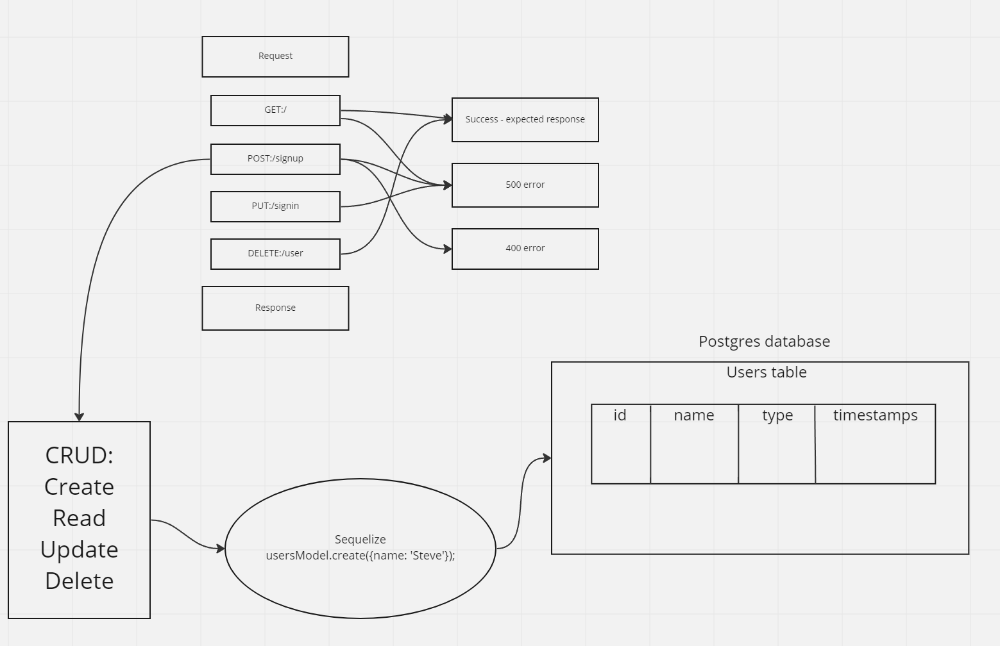

# Lab - Class06

## Project: Basic Authentication

### Author: Steve Gant

### Problem Domain
Refactor provided server using best practices, modularizing the code and provide tests.

### Links and Resources
  - [Github Actions ci/cd](https://github.com/stevengant/basic-auth/actions)
  - [back-end server surl](https://stevegant-basic-auth.onrender.com)

### Setup

.env requirements (where applicable)

DATABASE_URL=postgres://localhost:5432/basic-auth

### How to initialize/run your application (where applicable)
  - e.g. npm start

### How to use your library (where applicable)

#### Features / Routes

  - Feature One: Details of feature
  - GET : /person - specific route to hit

### Tests

  - How do you run tests?
  - Any tests of note?
  - describe any tests that you did not complete, skipped, etc

### UML

